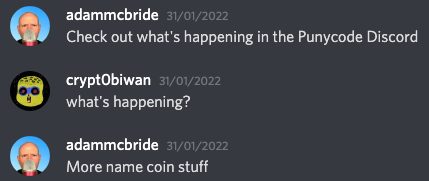

# Namecoin archeology "Gospel according to Matthew"

So I've been in the Punycodes Discord for a while, discussing Namecoin stuff, punycodes mostly but also other Namecoin stuff like identities (`id/` prefix). Then 2 days ago (January 31st 2022) [Adam McBride](https://twitter.com/adamamcbride) told me:



"Check out what's happening in the Punycode Discord". I hadn't seen it yet but user [Swooty](https://twitter.com/swooty_dev) (admin of the [NFT relics Discord](discord.gg/nft-relics)) shared he found this utf8 art cat encoded as a hex name:

```
       /\_/\ 
  ____/ o o \ 
 /~____ =ø= /
 (______)__m_
```
This is the [involved tx](https://nmc.tokenview.com/en/tx/cb010601d687664fc4bfd23a1a18b84a3cfec8d2cd82e2813a32ecd440c55b64) for those wondering.

Then I realised "OMG I have to explore this too!"

So he shared his (I think) MySQL JSON export with over 700k items in it.
Then the digging began....
A little while later he shared [this wonderful tool](https://app.powerbi.com/view?r=eyJrIjoiMjIzZjIwMmYtNzdjMi00MTgwLThmNTktNTIwYTdkZDcwZmM2IiwidCI6ImZiMTQ3YmQ3LTQwODUtNDliYS05OWY2LTE3ZmNjYzA4YzZkYyIsImMiOjl9) he setup together with Poodle, which really helped a lot of people searching the big chunk of data.

After registering some short emoji names and symbols I stumbled upon these weird names:

```
nmcf/Κατά Ματθαίον/1/301/1404958387415979770
nmcf/Κατά Ματθαίον/2/301/1404958387415979770
nmcf/Κατά Ματθαίον/3/301/1404958387415979770
```

What was this? Looks like Greek? So I pasted it in Google Translate.


The `nmcf` part I think should represent "Namecoin Files".
So there were 301 names which had this "Κατά Ματθαίον".
The last number in the filename is the timestamp (in unix epoch format). When you [convert](https://www.epochconverter.com/) `1404958387415979770` you get "Thursday, 10 July 2014 02:13 GMT"
I noticed those names had some encoded values in it (for example `nmcf/Κατά Ματθαίον/1/301/1404958387415979770` contained this in the `name_values` property):

```
77u/zpLhvbfOss67zr/PgiDOs861zr3hvbPPg861z4nPgiDhvLjOt8+Dzr/hv6YgzqfPgc65z4PPhM6/4b+mLCDPheG8sc6/4b+mIM6UzrHPheG/ks60LCDPheG8sc6/4b+mIOG8iM6yz4HOseG9sc68LiDhvIjOss+BzrHhvbDOvCDhvJDOs+G9s869zr3Ot8+DzrXOvSDPhOG9uM69IOG8uM+DzrHhvbHOuiwg4by4z4POseG9sM66IM604b2yIOG8kM6z4b2zzr3Ovc63z4POtc69IM+E4b24zr0g4by4zrHOuuG9vc6yLCDhvLjOsc664b28zrIgzrThvbIg4byQzrPhvbPOvc69zrfPg861zr0gz4ThvbjOvSDhvLjOv+G9u860zrHOvSDOus6x4b22IM+Ezr/hvbrPgiDhvIDOtM61zrvPhs6/4b26z4IgzrHhvZDPhM6/4b+mLCDhvLjOv+G9u860zrHPgiDOtOG9siDhvJDOs+G9s869zr3Ot8+DzrXOvSDPhOG9uM69IM6mzrHPgeG9ss+CIM66zrHhvbYgz4ThvbjOvSDOls6xz4HhvbAg4byQzrogz4Thv4bPgiDOmOG9sc68zrHPgSwgzqbOsc+B4b2yz4IgzrThvbIg4byQzrPhvbPOvc69zrfPg861zr0gz4ThvbjOvSDhvJnPg8+B4b29zrwsIOG8mc+Dz4HhvbzOvCDOtOG9siDhvJDOs+G9s869zr3Ot8+DzrXOvSDPhOG9uM69IOG8iM+B4b2xzrwsIOG8iM+B4b2wzrwgzrThvbIg4byQzrPhvbPOvc69zrfPg861zr0gz4ThvbjOvSDhvIjOvM65zr3Osc604b2xzrIsIOG8iM68zrnOvc6xzrThvbDOsiDOtOG9siDhvJDOs+G9s869zr3Ot8+DzrXOvSDPhOG9uM69IM6dzrHOsc+Dz4Phvb3OvSwgzp3Osc6xz4PPg+G9vM69IM604b2yIOG8kM6z4b2zzr3Ovc63z4POtc69\",\"77u/zpLhvbfOss67zr/PgiDOs861zr3hvbPPg861z4nPgiDhvLjOt8+Dzr/hv6YgzqfPgc65z4PPhM6/4b+mLCDPheG8sc6/4b+mIM6UzrHPheG/ks60LCDPheG8sc6/4b+mIOG8iM6yz4HOseG9sc68LiDhvIjOss+BzrHhvbDOvCDhvJDOs+G9s869zr3Ot8+DzrXOvSDPhOG9uM69IOG8uM+DzrHhvbHOuiwg4by4z4POseG9sM66IM604b2yIOG8kM6z4b2zzr3Ovc63z4POtc69IM+E4b24zr0g4by4zrHOuuG9vc6yLCDhvLjOsc664b28zrIgzrThvbIg4byQzrPhvbPOvc69zrfPg861zr0gz4ThvbjOvSDhvLjOv+G9u860zrHOvSDOus6x4b22IM+Ezr/hvbrPgiDhvIDOtM61zrvPhs6/4b26z4IgzrHhvZDPhM6/4b+mLCDhvLjOv+G9u860zrHPgiDOtOG9siDhvJDOs+G9s869zr3Ot8+DzrXOvSDPhOG9uM69IM6mzrHPgeG9ss+CIM66zrHhvbYgz4ThvbjOvSDOls6xz4HhvbAg4byQzrogz4Thv4bPgiDOmOG9sc68zrHPgSwgzqbOsc+B4b2yz4IgzrThvbIg4byQzrPhvbPOvc69zrfPg861zr0gz4ThvbjOvSDhvJnPg8+B4b29zrwsIOG8mc+Dz4HhvbzOvCDOtOG9siDhvJDOs+G9s869zr3Ot8+DzrXOvSDPhOG9uM69IOG8iM+B4b2xzrwsIOG8iM+B4b2wzrwgzrThvbIg4byQzrPhvbPOvc69zrfPg861zr0gz4ThvbjOvSDhvIjOvM65zr3Osc604b2xzrIsIOG8iM68zrnOvc6xzrThvbDOsiDOtOG9siDhvJDOs+G9s869zr3Ot8+DzrXOvSDPhOG9uM69IM6dzrHOsc+Dz4Phvb3OvSwgzp3Osc6xz4PPg+G9vM69IM604b2yIOG8kM6z4b2zzr3Ovc63z4POtc69
```

Looks like gibberish, right?
Well, when you paste this in [a base64 decoder](https://www.base64decode.org/) you get this:

```
Βίβλος γενέσεως Ἰησοῦ Χριστοῦ, υἱοῦ Δαυῒδ, υἱοῦ Ἀβραάμ. Ἀβραὰμ ἐγέννησεν τὸν Ἰσαάκ, Ἰσαὰκ δὲ ἐγέννησεν τὸν Ἰακώβ, Ἰακὼβ δὲ ἐγέννησεν τὸν Ἰούδαν καὶ τοὺς ἀδελφοὺς αὐτοῦ, Ἰούδας δὲ ἐγέννησεν τὸν Φαρὲς καὶ τὸν Ζαρὰ ἐκ τῆς Θάμαρ, Φαρὲς δὲ ἐγέννησεν τὸν Ἑσρώμ, Ἑσρὼμ δὲ ἐγέννησεν τὸν Ἀράμ, Ἀρὰμ δὲ ἐγέννησεν τὸν Ἀμιναδάβ, Ἀμιναδὰβ δὲ ἐγέννησεν τὸν Ναασσών, Ναασσὼν δὲ ἐγέννησενΒίβλος γενέσεως Ἰησοῦ Χριστοῦ, υἱοῦ Δαυῒδ, υἱοῦ Ἀβραάμ. Ἀβραὰμ ἐγέννησεν τὸν Ἰσαάκ, Ἰσαὰκ δὲ ἐγέννησεν τὸν Ἰακώβ, Ἰακὼβ δὲ ἐγέννησεν τὸν Ἰούδαν καὶ τοὺς ἀδελφοὺς αὐτοῦ, Ἰούδας δὲ ἐγέννησεν τὸν Φαρὲς καὶ τὸν Ζαρὰ ἐκ τῆς Θάμαρ, Φαρὲς δὲ ἐγέννησεν τὸν Ἑσρώμ, Ἑσρὼμ δὲ ἐγέννησεν τὸν Ἀράμ, Ἀρὰμ δὲ ἐγέννησεν τὸν Ἀμιναδάβ, Ἀμιναδὰβ δὲ ἐγέννησεν τὸν Ναασσών, Ναασσὼν δὲ ἐγέννησεν
```

OMFG, someone put the entire "Gospel according to Matthew" (all 28 chapters) on the Namecoin blockchain back in 2014?!?!?! That is f*cking awesome!! 🤩

Then my journey began to register all of the 301 parts, it took me all day (I guess something like 12-14 hours) before they were all confirmed. In the meantime I hope nobody else would register some 🤞

You can see all the name parts in the `gospel-parts.txt` file. 
The corresponding hex encoded names (and name_values etc) are in the `gospel-sorted.json`

So when I finally got them I _needed_ to write [This Medium article](https://crypt0biwan.medium.com/namecoin-archeology-gospel-according-to-matthew-5e3ad605483) to share it with the world. What an honor to excavate this beautiful historical pieces.

I'd like to thank everyone in the Punycodes Discord that I was chatting with, it eventually led to this amazing discovery!

## Links

* [The Punycodes Discord](discord.gg/kq7afpdrFa)
* [Punycodes on Twitter](https://twitter.com/Punycodes2011)
* [Greek "Gospel according to Matthew" on Bible Hub](https://biblehub.com/nestle/matthew/1.htm)
